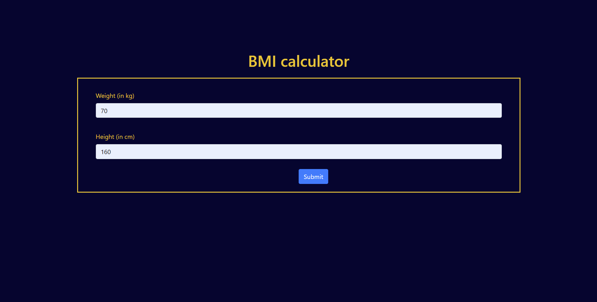
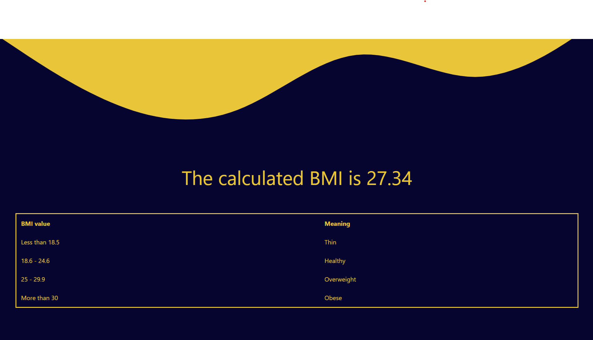

# BMI calculator
> a flask app that can calculate BMI of a person

## Frameworks or Languages Used 
 
  * Flask
  * Python
  
## Project Setup
  
  * First Clone the repository.
  * run the app.py 
  * The Application will be hosted at  `127.0.0.1:5000`
  
## Project UI
  Index page
  
  Result page
  
